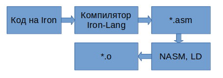

<div id="Доброе утро">
    
    
    
    
    
 </div>

# Введение

Iron - Язык программирования созданный командой DisStudio, в 2022(статус: в разработке).
Компилятор которого написан на языке JavaScript.



# Компиляция компилятора

Для начал компилирования, установите PKG:
```sh
make libs
```

Команда для компилирования компилятора:
```sh
make build
```

# Аргументы запуска

Чтоб запустить код через уже скомпилированный интерпретатор, пропишите:
```sh
./build/Iron-Lang-linux <path/to/file.in>
```

# Документация

Документация к языку находится в директории docs.
